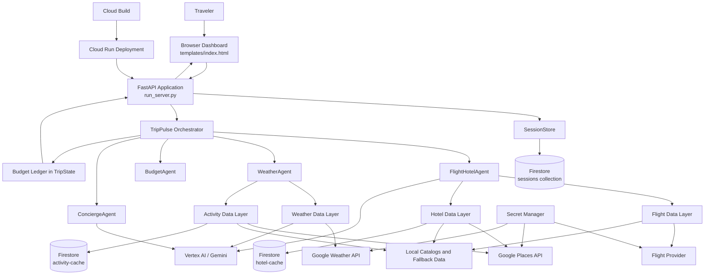

# TripPulse Multi-Agent Travel Concierge

## 1. Project Description

TripPulse is a cloud-hosted, multi-agent travel concierge that creates personalized travel plans from a destination, travel dates, budget, and travel preferences.

The application combines specialized agents to:

- Discover flight and hotel options.
- Retrieve destination weather forecasts.
- Build a day-by-day activity itinerary.
- Replace outdoor activities with indoor alternatives when severe rain is predicted.
- Audit trip spending against the user's budget.
- Generate a concise trip summary for the traveler.
- Persist trip state so plans can be retrieved and updated later.

The user interacts with TripPulse through a browser dashboard. The backend is implemented with FastAPI and is designed for deployment to Google Cloud Run. Google Cloud services provide runtime hosting, Firestore persistence, Secret Manager access, Vertex AI/Gemini assistance, and optional external data integrations.

## 2. Project Use Case

A traveler wants to plan a four-day trip to Delhi with a fixed budget. They enter the destination, dates, and budget in the TripPulse dashboard and submit the request.

TripPulse then:

1. Creates a shared `TripState` for the trip.
2. Searches for flight and hotel options using configured APIs, local catalogs, or fallback data.
3. Retrieves the weather forecast for each travel date.
4. Creates a daily activity plan based on the destination.
5. Reviews rain probability and replaces outdoor activities with indoor alternatives when needed.
6. Calculates flight, hotel, and activity spending.
7. Runs a budget audit and marks the plan as confirmed or alerts the user when spending exceeds the available budget.
8. Returns the selected hotel, weather-aware itinerary, budget summary, and trip overview to the dashboard.

This is useful for travelers who want a practical first itinerary quickly, while still accounting for constraints that are difficult to manage manually, such as weather disruptions, budget limits, hotel availability, and changing travel preferences.

## 3. Architecture Diagram

### Main Components

- **Browser dashboard:** Collects trip preferences and renders the selected hotel, weather details, summary, and itinerary.
- **FastAPI application:** Exposes planning, trip retrieval, health, and disruption endpoints.
- **TripPulse Orchestrator:** Runs flight/hotel and weather discovery in parallel, then runs budget auditing and persists the combined state.
- **Specialized agents:** Each agent owns one planning responsibility while sharing the `TripState` contract.
- **Data layers:** Encapsulate provider calls, caching, local catalogs, and fallback behavior.
- **Firestore:** Stores trip sessions and optional hotel/activity cache entries.
- **Vertex AI/Gemini:** Supports destination coordinate resolution, option selection, and natural-language trip summaries.
- **Cloud Build and Cloud Run:** Build, publish, and deploy the service as a containerized application.
